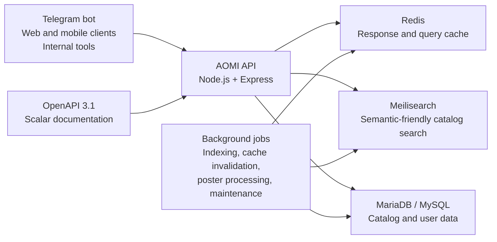

<div align="center">

# AOMI API

### A production API for anime discovery, metadata, schedules, recommendations, and the AOMI Telegram ecosystem.

[](https://api.aomi.tv)
[](#technology)
[](#api-documentation)
[](#project-status)

[Live API documentation](https://api.aomi.tv)

</div>

---

## Overview

**AOMI API** is the backend platform behind the AOMI anime library and Telegram experience.

It provides structured data for anime discovery, catalog browsing, multilingual metadata, episode navigation, release schedules, trending titles, personalized libraries, watch history, ratings, notifications, and recommendation features.

The project is being modernized around a clean `/v2` API with smaller responses, predictable contracts, proper HTTP status codes, caching, searchable documentation, and a migration path that does not break existing clients.

> The live documentation at [api.aomi.tv](https://api.aomi.tv) is the source of truth for endpoints currently available in production.

## Why AOMI exists

Anime data is often fragmented across websites, languages, inconsistent naming systems, and interfaces that are difficult to reuse in bots or lightweight applications.

AOMI aims to provide one practical application layer for:

- finding anime by title, synonym, genre, status, year, or natural-language intent;
- serving compact cards for fast Telegram and mobile interfaces;
- keeping localized titles, descriptions, genres, and episode information together;
- tracking user progress, favorites, lists, ratings, and notifications;
- building recommendation and editorial tools without coupling them to a single UI;
- giving developers a documented API instead of forcing them to scrape pages.

## What powers AOMI

AOMI API currently supports the broader AOMI product ecosystem:

- **Anime catalog** — searchable and filterable title data;
- **Telegram library bot** — title discovery, episode navigation, saved lists, and continued watching;
- **Semantic search** — discovery by meaning rather than only exact title matches;
- **AI assistant** — natural-language anime questions and recommendations;
- **Personal features** — history, favorites, lists, ratings, and notifications;
- **Editorial workflows** — structured metadata and tools for maintaining the catalog.

## Core capabilities

### Catalog and discovery

- Anime lists with pagination, sorting, and filters
- Search across canonical titles and alternative titles
- Typo-tolerant and relevance-aware search through Meilisearch
- Similar titles and franchise seasons
- Trending titles based on real usage signals
- Genre showcases and homepage banners

### Anime and episode data

- Detailed anime metadata
- Multilingual titles, descriptions, and genres
- Episode lists separated from heavy anime detail responses
- Audio-track information
- Release schedules by weekday or relative day
- Latest-episode feeds
- Responsive poster variants and blur placeholders

### User platform

The existing authenticated API also powers:

- user accounts;
- personal anime libraries;
- watch history and progress;
- ratings;
- recommendations;
- release notifications;
- premium-related application features.

Authenticated routes remain compatible while the public content API moves toward `/v2`.

## API design

The `/v2` contract is designed around small, consistent response envelopes.

### List response

```json
{
  "schemaVersion": 1,
  "items": [],
  "pageInfo": {
    "page": 1,
    "pageSize": 24,
    "hasNext": false
  }
}
```

### Detail response

```json
{
  "schemaVersion": 1,
  "data": {
    "id": 1,
    "title": "Example title"
  }
}
```

### Error response

```json
{
  "schemaVersion": 1,
  "error": {
    "code": "not_found",
    "message": "Anime was not found."
  }
}
```

Errors use real HTTP status codes and are returned with `Cache-Control: no-store`.

## API surface

The planned `/v2` public surface is intentionally focused and composable:

| Endpoint | Purpose |
|---|---|
| `GET /v2/animes` | Search, filter, sort, and paginate anime |
| `GET /v2/showcase` | Curated genre and catalog showcases |
| `GET /v2/anime/:id` | Lightweight anime details without embedded episodes |
| `GET /v2/anime/:id/episodes` | Complete episode list for an anime |
| `GET /v2/anime/:id/similar` | Deterministic similar-title cards |
| `GET /v2/anime/:id/seasons` | Franchise and season relationships |
| `GET /v2/episode/:id` | Episode details and parent anime card |
| `GET /v2/episodes/latest` | Recently added episodes |
| `GET /v2/schedule` | Current release schedule |
| `GET /v2/schedule/:day` | Schedule for a weekday or relative day |
| `GET /v2/genres` | Localized genres with optional icons |
| `GET /v2/banner` | Homepage banner content |
| `GET /v2/trending` | Popular anime for a selected period |

Legacy public routes remain available during migration and are marked as deprecated in the API documentation where applicable.

## Example requests

### Browse the current catalog

```bash
curl "https://api.aomi.tv/catalog?pageSize=6"
```

### Browse anime through the v2 contract

```bash
curl "https://api.aomi.tv/v2/animes?page=1&pageSize=24&status=ongoing"
```

### Search by title or synonym

```bash
curl --get "https://api.aomi.tv/v2/animes" \
  --data-urlencode "q=shingeki no kyojin"
```

### Load localized anime details

```bash
curl "https://api.aomi.tv/v2/anime/1?lang=en"
```

### Request the weekly schedule

```bash
curl "https://api.aomi.tv/v2/schedule"
```

Supported content languages in the v2 contract:

```text
ru · ua · bl · kz · en
```

## API documentation

Interactive API documentation is available at:

**https://api.aomi.tv**

The documentation is being standardized around:

- OpenAPI 3.1;
- Scalar API Reference;
- documented enums and parameter limits;
- response schemas;
- examples;
- authentication definitions;
- deprecation markers for legacy routes;
- in-browser request testing.

## Architecture



## Technology

- **Node.js**
- **Express**
- **MariaDB / MySQL**
- **Redis**
- **Meilisearch**
- **OpenAPI 3.1**
- **Scalar API Reference**
- **PM2**
- **WebP poster processing**
- **ETag and HTTP cache validation**

## Performance strategy

The API modernization is focused on removing unnecessary work rather than only adding more infrastructure.

Important improvements include:

- replacing internal self-HTTP requests with direct service calls;
- avoiding `SELECT *` for public API responses;
- separating anime details from episode collections;
- hydrating compact catalog cards in batches;
- eliminating empty `IN ()` queries;
- removing random database sorting from cacheable v2 routes;
- adding Redis caching with explicit invalidation;
- using ETag and `304 Not Modified`;
- returning responsive poster sizes instead of one oversized asset;
- keeping legacy clients operational during gradual migration.

The target result is significantly smaller payloads, fewer database queries, better cache reuse, and more predictable latency for Telegram and mobile clients.

## Reliability and operations

The production roadmap includes:

- database-aware health checks;
- smoke tests for every public v2 route;
- validation of success, error, and `304` responses;
- deprecation tracking for legacy endpoints;
- structured cache namespaces and invalidation;
- periodic cleanup of operational database tables;
- safe poster generation with atomic file replacement;
- database indexes for frequently used relationships;
- graceful fallback when Meilisearch is temporarily unavailable.

## Local development

### Prerequisites

- Node.js
- npm
- MariaDB or MySQL
- Redis
- Meilisearch

### Install

```bash
git clone <your-repository-url>
cd aomi-api
npm install
```

Configure the required environment variables for the database, Redis, Meilisearch, authentication, and server port.

Never commit production credentials or `.env` files.

### Start

```bash
npm start
```

The production service is normally managed with PM2. Local process management can be chosen independently.

## Testing

The project favors focused tests and production smoke checks.

Typical checks include:

```bash
npm test
node scripts/v2-smoke.js
```

The v2 smoke suite is expected to verify:

- successful responses for every public route;
- response-envelope structure;
- ETag presence;
- `304 Not Modified`;
- invalid parameter handling;
- `400`, `404`, and `503` error envelopes;
- `Cache-Control: no-store` on errors.

## Project status

AOMI API is an active independent project running in production while its public content layer is being modernized.

Current priorities:

- [x] Production anime API
- [x] Telegram anime library integration
- [x] Catalog filtering and search
- [x] Redis and Meilisearch integration
- [x] Personal libraries, history, ratings, and notifications
- [ ] Complete `/v2` rollout
- [ ] Publish full OpenAPI 3.1 coverage
- [ ] Finish responsive poster variants
- [ ] Expand smoke and contract testing
- [ ] Add Claude-powered grounded discovery
- [ ] Add reviewed multilingual metadata assistance
- [ ] Publish contribution and deployment guides

## Contributing

The repository is being prepared for easier external review and contribution.

Useful contribution areas include:

- API contract tests;
- OpenAPI examples;
- query and cache optimization;
- multilingual data quality;
- accessibility of documentation;
- security hardening;
- observability;
- recommendation evaluation.

Before opening a pull request, keep public response compatibility in mind and avoid changing legacy response shapes without a migration plan.

## Security

Do not report security vulnerabilities through public GitHub issues.

Please contact the project owner privately and include:

- the affected endpoint or component;
- reproduction steps;
- potential impact;
- suggested mitigation, when available.

Never include real access tokens, passwords, personal user data, or destructive proof-of-concept payloads.

## Legal note

AOMI API is an independent software project and is not affiliated with anime studios, publishers, distributors, or third-party databases.

Anime names, artwork, and other referenced media remain the property of their respective owners. Anyone deploying or extending the project is responsible for complying with applicable licenses, platform rules, and content rights.

## Links

- **API and documentation:** https://api.aomi.tv
- **Telegram bot:** https://t.me/aomiLibrary_bot?start
- **Telegram channel:** https://t.me/aomi_anime

---

<div align="center">

Built to make anime discovery faster, structured, multilingual, and easier to integrate.

</div>
